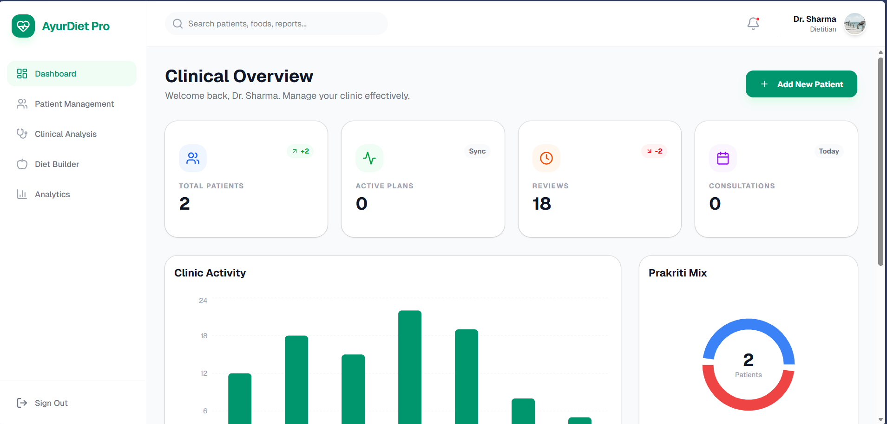
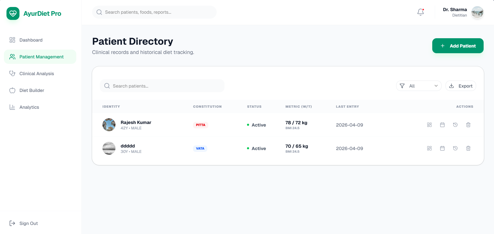
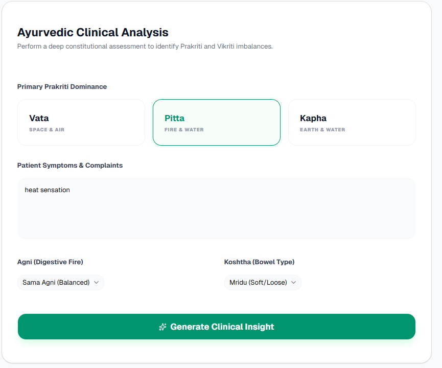
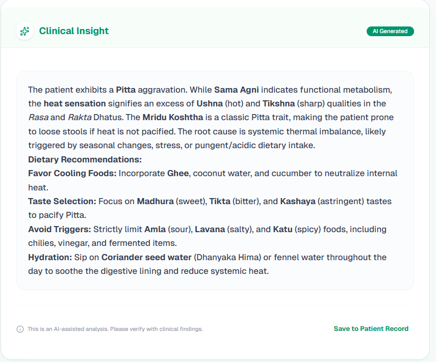
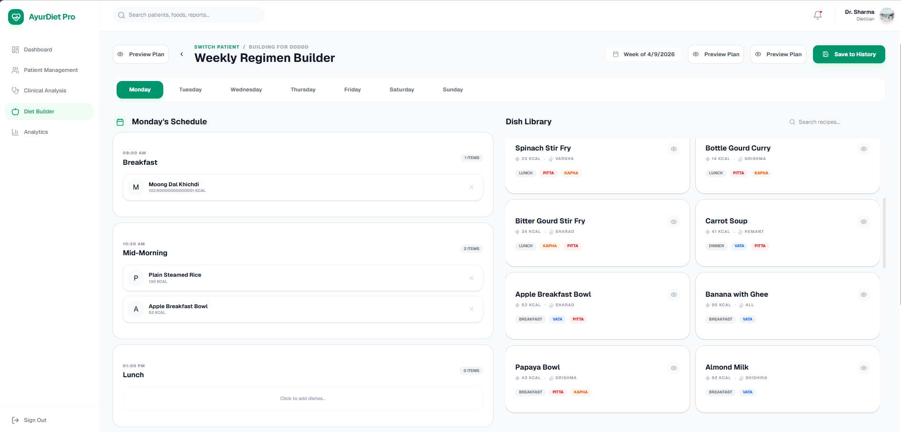
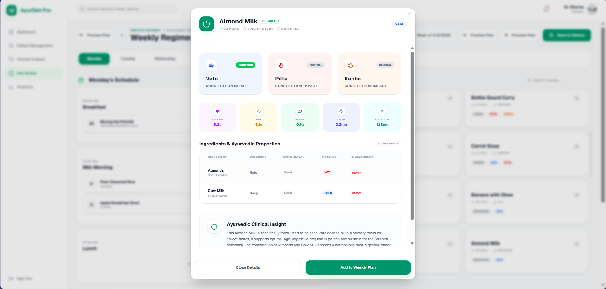
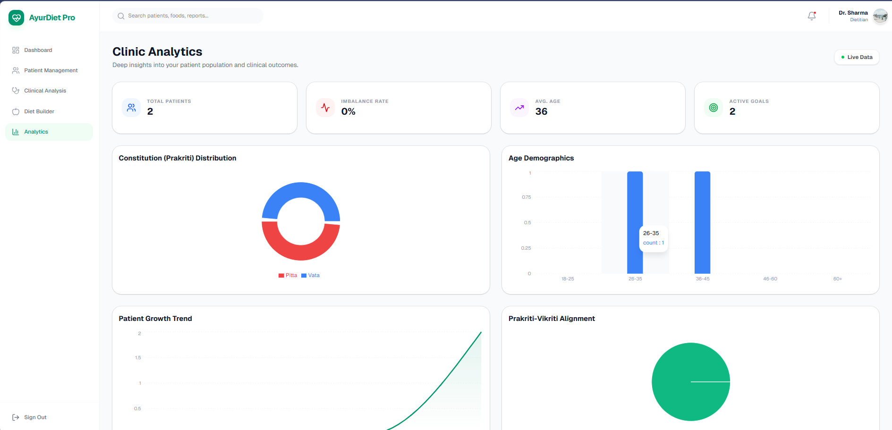
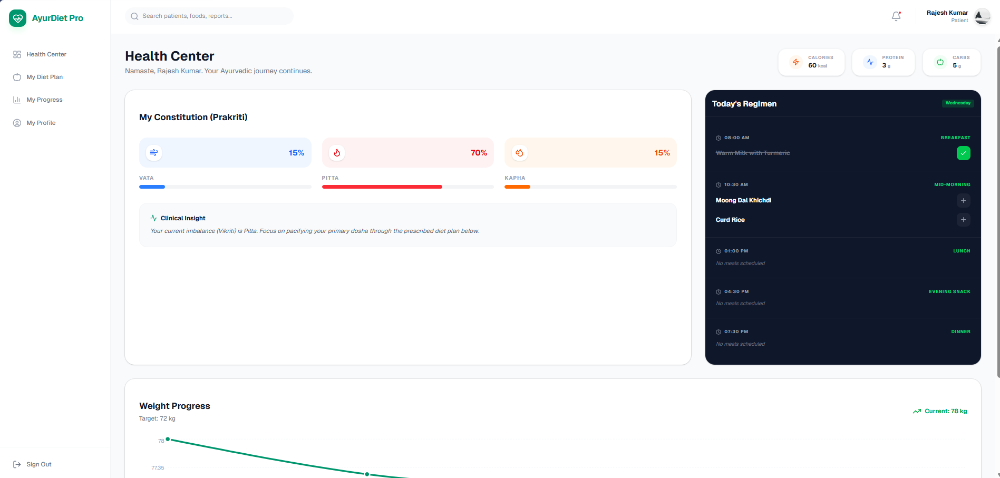
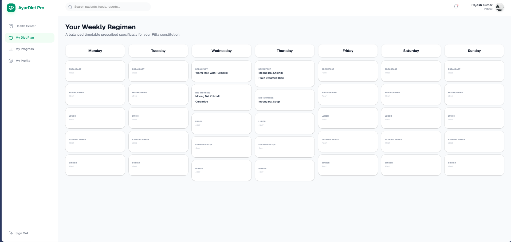

# 🌿 AyurDiet Pro

> **"Wisdom meets Science"** — Bridging traditional Ayurvedic knowledge with modern nutritional science through AI-powered clinical intelligence.
<div align="center">

[](https://ayurdiet.vercel.app/)
[](https://github.com/gauransh-singh/ayurdiet-pro)

</div>



---

## 📋 Table of Contents

- [Overview](#overview)
- [Core Philosophy](#core-philosophy)
- [Features](#features)
  - [Dietitian Portal](#-dietitian-portal)
  - [Patient Portal](#-patient-portal)
- [Tech Stack](#tech-stack)
- [Key Innovations](#key-innovations)
- [Screenshots](#screenshots)
- [Getting Started](#getting-started)
- [Project Structure](#project-structure)
- [Security](#security)

---

## Overview

**AyurDiet Pro** is a sophisticated, full-stack digital health platform designed as a **dual-portal ecosystem**:

- 👨‍⚕️ **Dietitians (Practitioners)** — Manage clinics with data-driven precision
- 🧘 **Patients** — Follow personalized, dosha-specific health journeys with real-time tracking

By identifying each user's unique **Prakriti** (Birth Constitution) and **Vikriti** (Current Imbalance), the system uses **Gemini AI** to generate personalized regimens that balance the three Doshas — **Vata**, **Pitta**, and **Kapha**.

---

## Core Philosophy

Health is not one-size-fits-all. AyurDiet Pro combines the timeless wisdom of Ayurveda with the precision of modern data science to deliver truly personalized health journeys — not generic diet plans.

---

## Features

### 👨‍⚕️ Dietitian Portal

#### 📊 Clinical Overview Dashboard
- Real-time stats on total patients, active diet plans, and daily consultations
- Clinic activity charts and Prakriti mix distribution
- Live data sync via Firebase real-time listeners

#### 🤖 AI-Powered Clinical Analysis
- Deep constitutional assessment using **Gemini API**
- Analyzes patient **Prakriti** (Vata / Pitta / Kapha), symptoms, **Agni** (digestive fire), and **Koshtha** (bowel type)
- Generates professional clinical insights with dietary recommendations in markdown format
- Results saved directly to the patient record

#### 🗓️ Weekly Regimen Builder
- 7-day meal planning interface with **drag-and-drop** functionality
- Comprehensive **Ayurvedic Dish Library** with calorie counts, seasonal tags, and dosha labels
- Per-meal slot scheduling: Breakfast, Mid-Morning, Lunch, Evening Snack, Dinner
- Preview plan before saving to patient history

#### 👥 Patient Management Directory
- Full clinical database for tracking patient history
- Constitutional tags (VATA / PITTA / KAPHA) per patient
- Weight metrics, BMI tracking, and appointment history
- Export functionality for clinical records

#### 📅 Appointment Scheduler
- Integrated calendar for initial and review consultations
- Tracks consultation count and review history per patient

---

### 🧘 Patient Portal (Health Center)

#### 🌊 Dosha Visualization
- Real-time tracking of Vata, Pitta, and Kapha balance levels
- Visual progress bars showing constitutional percentages
- Clinical insight card showing current Vikriti imbalance

#### 🍽️ Real-Time Meal Logging
- Mark meals as "Taken" directly from the daily schedule
- Today's Regimen panel showing all meal slots with timing
- Live calorie, protein, and carbohydrate aggregation

#### 📆 Personalized Weekly Regimen View
- Full 7-day timetable prescribed by the dietitian
- Meal-specific scheduling across all time slots
- Constitution-specific subtitle (e.g., "prescribed for your Pitta constitution")

#### 📈 Weight & Progress Analytics
- Interactive weight progress chart with target tracking
- Journey visualization from current to goal weight

---

## Tech Stack

| Layer | Technology |
|---|---|
| **Frontend** | React 18 + Vite |
| **Styling** | Tailwind CSS (Bento-grid aesthetic) |
| **Animations** | Motion (Framer Motion) |
| **Backend** | Firebase (Firestore + Auth) |
| **Database** | Cloud Firestore (real-time listeners) |
| **AI** | Google Gemini API |
| **Security** | Firestore Security Rules |

---

## Key Innovations

### 1. 🔒 Action-Based Update Pattern
A secure architecture allowing patients to log meal data without having direct write access to their clinical records. Patient actions trigger controlled Firestore updates that only modify permitted fields — protecting the integrity of the doctor's clinical data.

### 2. 🧮 Nutrient Calculation Engine
A library-first approach that calculates recipe macros based on standardized ingredient units. Each dish in the Ayurvedic library has pre-defined nutritional data, enabling automatic calorie/protein/carb aggregation as patients log meals throughout the day.

### 3. ⚡ Cross-Platform Real-Time Sync
Firestore real-time listeners ensure that when a patient logs a meal, the dietitian's dashboard updates instantly — enabling proactive clinical intervention without page refreshes.

### 4. 🌿 Ayurvedic Dish Intelligence
Each dish in the library carries rich metadata: seasonal availability (Varsha, Grishma, Shishira), dosha impact (Pacifying / Neutral / Aggravating for Vata, Pitta, Kapha), taste category (Rasa), potency, and digestibility — enabling truly dosha-aware meal planning.

---

## Screenshots

### Dietitian Portal

| Clinical Dashboard | Patient Directory |
|---|---|
|  |  |

| Clinical Analysis Input | AI Clinical Insight Output |
|---|---|
|  |  |

| Weekly Regimen Builder | Dish Detail Modal |
|---|---|
|  |  |

| Clinic Analytics |
|---|
|  |

### Patient Portal

| Health Center | Weekly Regimen View |
|---|---|
|  |  |

---

## Getting Started

### Prerequisites
- Node.js 18+
- Firebase project with Firestore and Authentication enabled
- Google Gemini API key

### Installation

```bash
# Clone the repository
git clone https://github.com/gauransh-singh/ayurdiet-pro.git

# Navigate to project
cd ayurdiet-pro

# Install dependencies
npm install

# Set up environment variables
cp .env.example .env
```

### Environment Variables

```env
VITE_FIREBASE_API_KEY=your_firebase_api_key
VITE_FIREBASE_AUTH_DOMAIN=your_project.firebaseapp.com
VITE_FIREBASE_PROJECT_ID=your_project_id
VITE_FIREBASE_STORAGE_BUCKET=your_project.appspot.com
VITE_FIREBASE_MESSAGING_SENDER_ID=your_sender_id
VITE_FIREBASE_APP_ID=your_app_id
VITE_GEMINI_API_KEY=your_gemini_api_key
```

### Run Locally

```bash
npm run dev
```

---

## Project Structure

```
ayurdiet-pro/
├── src/
│   ├── components/
│   │   ├── dietitian/          # Dietitian portal components
│   │   │   ├── Dashboard/
│   │   │   ├── PatientManagement/
│   │   │   ├── ClinicalAnalysis/
│   │   │   ├── DietBuilder/
│   │   │   └── Analytics/
│   │   └── patient/            # Patient portal components
│   │       ├── HealthCenter/
│   │       ├── DietPlan/
│   │       ├── Progress/
│   │       └── Profile/
│   ├── lib/
│   │   ├── firebase.js         # Firebase config & init
│   │   ├── gemini.js           # Gemini API integration
│   │   └── nutrientEngine.js   # Nutrient calculation logic
│   ├── hooks/                  # Custom React hooks
│   ├── context/                # Auth & app context
│   └── App.jsx
├── firestore.rules             # Security rules
├── vite.config.js
└── tailwind.config.js
```

---

## Security

AyurDiet Pro implements **professional-grade Firestore Security Rules** to protect sensitive health data:

- **PII Protection** — Patient personal data is only accessible to their assigned dietitian
- **Practitioner Isolation** — Dietitian clinic data is completely isolated between practitioners
- **Action-Based Writes** — Patients can only write to permitted fields via controlled action patterns
- **Auth-Gated Access** — All Firestore reads/writes require Firebase Authentication

---

## Built By

**Gauransh Singh** — BCA (AI/ML) · Galgotias University · Greater Noida

[](https://linkedin.com/in/gauransh-singh-211586294)
[](https://gauransh-singh.vercel.app/)
[](https://github.com/gauransh-singh)

---

*AyurDiet Pro — Where ancient wisdom meets modern intelligence.*
